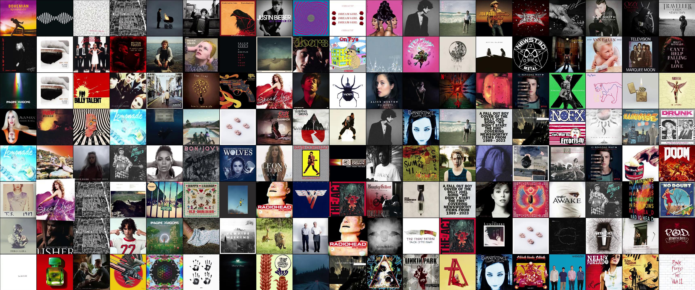

# 🖼️ Windows Universal Mosaic Screensaver (Album Art & Movie Posters)

[](https://github.com/forestslin/mosaic-screensaver-windows/raw/main/demo.mp4)

**English Introduction**
A stunning Windows screensaver inspired by macOS's classic "Artwork" (Album Art Mosaic) screensaver. It merges **Music Album Art** and **Movie Posters** into a single customizable screensaver:
1. **Music Album Art Mosaic**: Fetches hundreds of high-res album covers from iTunes (1:1 aspect ratio).
2. **Movie Poster Wall**: Displays gorgeous, vertical HD movie and TV show posters from TVMaze (2:3 aspect ratio).
3. **Mixed Mode**: Displays both side-by-side in alternating columns, perfectly filling the screen without black borders.

Features a dynamic, 3D flipping mosaic grid, multi-monitor support, zero dependencies (standalone executable), and a built-in settings UI to select your display mode and favorite music/movie genres.

---

这是一个惊艳的 Windows 屏幕保护程序，灵感来源于 macOS 经典的 "Artwork" (专辑封面马赛克) 屏保。现已将 **音乐唱片墙** 与 **电影海报墙** 完美合二为一！你可以在设置面板中自由选择展示纯唱片墙、纯电影海报墙、或者两者混搭，且完美适配任何屏幕比例，无任何黑边。

## 🌟 核心特性
- **支持三种展示模式**：
  - **仅音乐专辑 (1:1 比例)**：完美还原 macOS 唱片墙效果。
  - **仅电影海报 (2:3 比例)**：呈现大气的电影和剧集海报墙。
  - **唱片与海报混搭**：采用精巧的交替列布局，方圆与长宽巧妙融于一屏，完美填满屏幕，且图像显示完整无裁剪或拉伸。
- **丰富的流派标签**：内置设置面板，支持分别勾选 28 种音乐流派 (Pop, Rock, Jazz 等) 与 22 种电影类型 (Action, Sci-Fi, 华语电影等)。
- **翻转频率可调**：可在设置中设定 1-5 档翻转速度，定制你的专属动效节奏。
- **多显示器支持**：自动在所有连接的显示器上全屏运行。
- **单文件独立运行**：基于 .NET 6 和 WebView2 封装，无需安装多余依赖。

## 🚀 安装指南

### 方法 1：下载现成的单文件版 (推荐)
进入项目的 **[Release 页面](https://github.com/forestslin/mosaic-screensaver-windows/releases/latest)**，下载：
- `MosaicScreensaver_Standalone.scr`

**使用方法**：
1. **配置**：右键点击该 `.scr` 文件，选择 **配置 (Configure)**，选择展示模式并勾选喜欢的流派，以及设定翻转速度。
2. **测试**：双击 `.scr` 文件即可直接全屏预览（动一下鼠标或按任意键即可退出）。
3. **安装**：右键点击该 `.scr` 文件，选择 **安装 (Install)** 应用为默认系统屏保。

### 方法 2：源码编译
如果你想自行编译此项目：
1. 确保你的电脑安装了 `.NET 6.0 SDK` 或更高版本。
2. 克隆此仓库。
3. 打开终端进入项目目录，运行：
   ```bash
   dotnet publish -c Release -r win-x64 --self-contained true -p:PublishSingleFile=true -p:IncludeNativeLibrariesForSelfExtract=true -p:IncludeAllContentForSelfExtract=true
   ```
4. 到 `bin\Release\net6.0-windows\win-x64\publish\` 目录中找到生成的 `.exe`。
5. 将其后缀名重命名为 `.scr` 即可作为屏保使用。

## 🆕 更新日志 (Changelog)

### v3.2
- **【新增】封面翻转频率调节**：在两款屏保的设置面板中新增了“封面翻转频率”调节滑块（1-5档，1为最慢，3为默认，5为最快），可随心定制翻转的节奏。
- **【修复】界面文字修正**：修复了“电影海报墙”屏保设置界面中残留的“音乐/专辑”等文案错误，已全部修正为电影海报相关的描述。

### v3.0
- **【重磅】全新电影海报墙屏保发布！**：除音乐专辑外，现在推出了全新的电影海报专属屏保代码。
- **超清 2:3 海报比例**：完美适配竖版电影海报比例，视觉震撼。
- **28 种影视流派**：包含“动作”、“喜剧”、“科幻”，以及新增的“中国电影 (Chinese)”分类。

### v2.0
- **全新设置面板**：在 Windows 屏幕保护程序设置中点击“设置”，现在可以自由勾选多达 28 种分类！
- **修复黑边问题**：完美适配任何屏幕比例和多显示器，彻底消除所有黑边和封面裁切不完整问题。
- **自动发布更新**：集成了 GitHub Actions，自动构建并发布最新的单文件版屏保。

## 🛠️ 技术栈
- **前端**：Vanilla HTML5 + CSS3 (Grid & 3D Transforms) + JavaScript
- **外壳**：C# (.NET 6 Windows Forms) + Microsoft.Web.WebView2

## 📝 证书
MIT License
